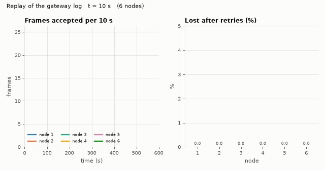
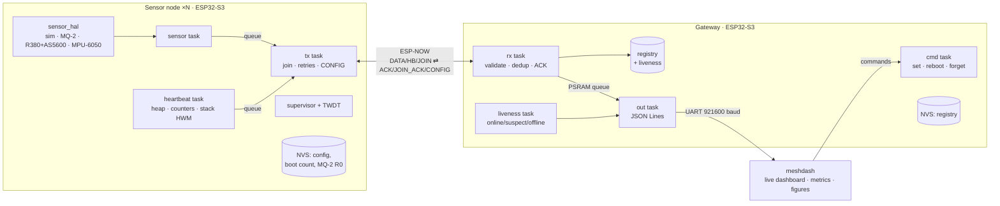
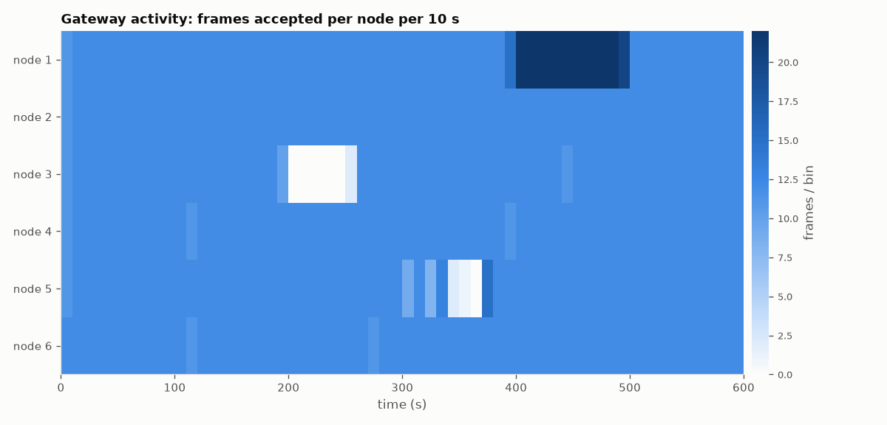
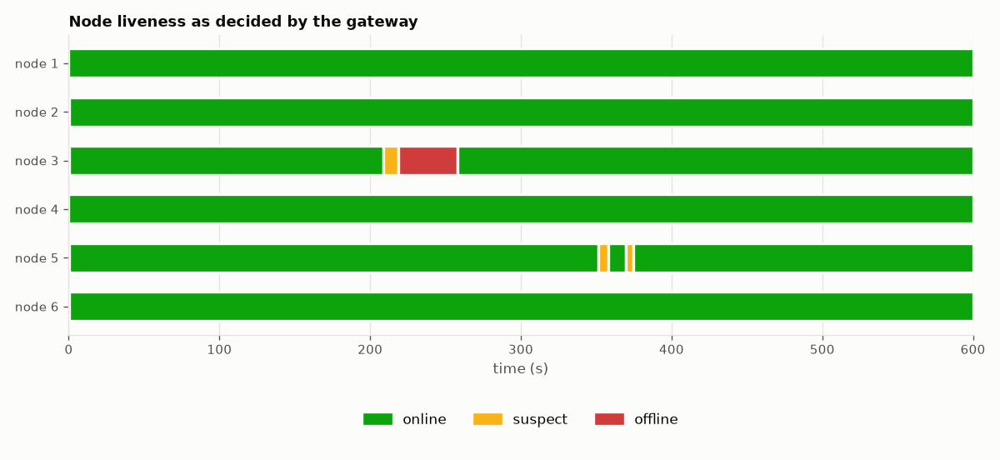
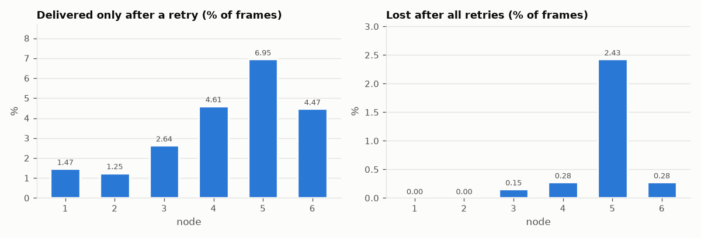
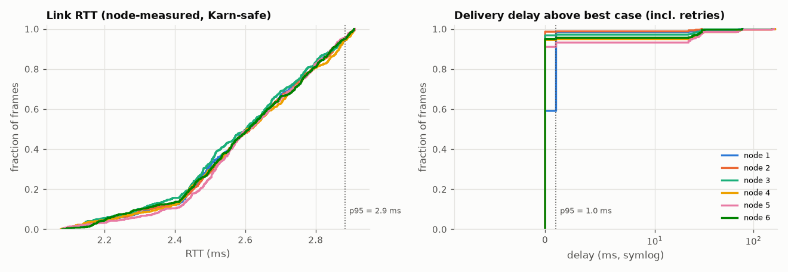

# ESP32-S3 FreeRTOS + ESP-NOW Sensor Mesh

[](https://github.com/julianS-eng/esp32-freertos-espnow-mesh/actions/workflows/ci.yml)
[](LICENSE)
[](pyproject.toml)
[](https://github.com/espressif/esp-idf)
[](docs/HARDWARE.md)

*Resumen en español: [README.es.md](README.es.md) · Guía de aprendizaje: [docs/LEARNING.md](docs/LEARNING.md)*

Production-style C firmware for **ESP32-S3** (ESP-IDF, `idf.py`, no Arduino) that
turns a handful of boards into a low-power wireless sensor network: **sensor
nodes** sample an MQ-2 gas sensor, an R380 motor with an AS5600 magnetic
encoder and an MPU-6050 IMU (or a deterministic simulator) and deliver readings
over **ESP-NOW** with acknowledgements, retries and loss accounting to a
**gateway** that tracks node liveness and streams **one JSON object per line**
over the serial port. A Python tool turns that stream into a live dashboard,
packet-loss/latency metrics and the figures below.



## Why this project

Most ESP-NOW examples stop at "send a struct, print it". Real deployments need
the parts around it: what happens when a frame or its ACK is lost, when the
gateway reboots, when a node dies, when the serial link cannot keep up, how big
each FreeRTOS stack must really be. This repository treats those as
first-class, testable engineering problems:

* **Protocol** – versioned, CRC-protected frames with sequence numbers,
  application ACKs (OK / DUPLICATE / BUSY / REJECTED / INVALID), stop-and-wait
  retries with exponential back-off and jitter, Karn-safe RTT, duplicate
  suppression and loss accounting with a sliding window, JOIN/re-join, remote
  configuration, node-down detection, optional ESP-NOW encryption (PMK/LMK).
* **FreeRTOS design** – four tasks on the node and five on the gateway with
  justified priorities/core affinity, queues, event groups, mutexes, task
  notifications, a two-layer watchdog, and stack sizes **measured** with
  `uxTaskGetStackHighWaterMark()`.
* **Testability** – every decision is made by pure C modules that are compiled
  into the firmware, into 100 Unity tests (ASan + UBSan) and into a
  deterministic discrete-event simulator. The Python decoder is checked byte for
  byte against frames produced by the C codec. Both firmwares boot and run in
  Espressif's QEMU in CI.

## Architecture



| Document | Contents |
|---|---|
| [docs/ARCHITECTURE.md](docs/ARCHITECTURE.md) | Task diagrams, priorities, stack sizing, synchronisation primitives, gateway state machine, simulator and QEMU design |
| [docs/PROTOCOL.md](docs/PROTOCOL.md) | Wire format, messages, sequence diagram, retries, loss accounting, liveness, security model, JSON Lines schema |
| [docs/HARDWARE.md](docs/HARDWARE.md) | Pin map and wiring for MQ-2, R380 + H-bridge + AS5600, GY-521 |
| [docs/LEARNING.md](docs/LEARNING.md) | (Español) Theory step by step, design decisions and rejected alternatives, 10 interview questions |

## Results

Every number, table and figure in this section was produced by running the
code in this repository (`scripts/reproduce_results.sh`, QEMU runs via
`scripts/qemu_run.sh`, sizes via `idf.py size`). **Radio-link numbers come from
the host simulator, whose channel parameters are inputs, not measurements** –
read them as a validation of the protocol logic, not as a field test.

### Reference simulation – 6 nodes, 600 s, seed 42

Scenario: 1 Hz readings (17 channels each), 5 s heartbeats; per-node bursty
channel (Gilbert–Elliott, 0.5–2.5 % loss in the good state, 60 % in the bad
state); node 3 loses power at t = 198 s and cold-boots at t = 258 s; node 5
suffers a 60 %-loss interference burst from t = 300 s to 360 s; the gateway
reconfigures node 1 to 500 ms reporting at t = 396 s and back at t = 498 s.

| Metric | Value |
|---|---|
| Unique frames accepted by the gateway | 4303 |
| Frames lost after all retries (gateway sequence gaps) | 22 (0.509 %) |
| Frames that needed at least one retry | 3.50 % |
| Duplicates suppressed (lost ACKs) | 130 |
| Link RTT p50 / p95 / p99 / max | 2.61 / 2.88 / 2.91 / 2.91 ms |
| Delivery delay above best case p50 / p95 / p99 / max | 0 / 1 / 30 / 166 ms |
| Remote CONFIG commands | 2 / 2 acknowledged on the first attempt |
| Dashboard metrics vs. gateway tracker and ground truth | 30 / 30 consistency checks pass |

| Node | Data | HB | Lost (gaps) | Loss % | Retried % | Dups | Node-reported abandoned / queue drops | RTT p95 ms | Delay p95 ms | RSSI avg dBm | Availability % |
|---:|---:|---:|---:|---:|---:|---:|---:|---:|---:|---:|---:|
| 1 | 700 | 119 | 0 | 0.000 | 1.5 | 8 | 4 / 0 | 2.89 | 1 | -48.1 | 100.0 |
| 2 | 599 | 119 | 0 | 0.000 | 1.3 | 8 | 0 / 0 | 2.88 | 0 | -54.1 | 100.0 |
| 3 | 537 | 107 | 1 | 0.155 | 2.6 | 16 | 6 / 0 | 2.88 | 0 | -60.1 | 93.4 |
| 4 | 597 | 119 | 2 | 0.278 | 4.6 | 28 | 7 / 0 | 2.89 | 5 | -66.3 | 100.0 |
| 5 | 563 | 113 | 17 | 2.429 | 7.0 | 37 | 32 / 32 | 2.88 | 24 | -72.1 | 100.0 |
| 6 | 597 | 119 | 2 | 0.278 | 4.5 | 33 | 5 / 0 | 2.88 | 0 | -78.1 | 100.0 |

Full tables, the 30 consistency checks and the simulator's node-side ground
truth: [docs/results/simulation.md](docs/results/simulation.md).

How to read it:

* **Retries hide most of the channel loss.** Nodes 4–6 needed a retransmission
  for 4.5–7 % of their frames, yet lost ≤ 0.28 % – except node 5, whose
  interference burst pushed it to 2.4 %, filled its 8-slot queue (32 readings
  dropped oldest-first) and forced four re-joins.
* **The node and the gateway disagree, and the gateway is right.** Node 1
  reports 4 frames abandoned after 4 attempts, but the gateway saw no gap: each
  of those frames arrived at least once, yet none of its ACKs made it back. The gateway's sequence
  tracker is the ground truth for loss; the node-side counter is an upper bound.
* **RTT ≈ 2.6 ms** is what the channel model implies: a 17-channel DATA frame is
  108 bytes (+ 43 bytes of 802.11/ESP-NOW overhead in the airtime model) at
  1 Mbit/s, plus 0.3–0.8 ms gateway processing and the 22-byte ACK back. The
  delivery-delay tail (p99 30 ms, max 166 ms) is the retry back-off.
* **Liveness**: node 3 is flagged SUSPECT 11.5 s and OFFLINE 21.5 s after its
  last frame (thresholds 2× and 4× the 5 s heartbeat + 1 s grace) and ONLINE
  again when it re-joins with `boot_count = 2`; availability 93.4 %.

| Activity per node (10 s bins) | Liveness decided by the gateway |
|---|---|
|  |  |




### Overload scenario – back-pressure

12 nodes at 5 Hz behind a 115 200-baud console (the gateway's JSON output needs
more bandwidth than the UART has): the gateway enters **DEGRADED** after 5.5 s
and answers **14 173 ACK(BUSY)** instead of silently dropping readings; nodes
back off, their drop-oldest queues discard 1 730 stale readings, and 121 log
records that could not be queued are dropped – which the dashboard's
cross-checks detect and report (4 checks fail by design). Details:
[docs/results/stress.md](docs/results/stress.md). The fix in a real deployment is
the default 921 600 baud or fewer channels per reading.

### Stack high-water marks (QEMU, final stack sizes)

Measured with `uxTaskGetStackHighWaterMark()` while both firmwares ran in
Espressif's QEMU with the loopback radio (node: 75 s; gateway: 110 s with four
emulated nodes, one going offline, and console commands exercising CONFIG).

| Firmware | Task | Stack (B) | Min free (B) | Peak used (B) | Head-room |
|---|---|---:|---:|---:|---:|
| sensor_node | sensor | 4096 | 3096 | 1000 | 76 % |
| sensor_node | tx | 5120 | 2244 | 2876 | 44 % |
| sensor_node | heartbeat | 3584 | 1312 | 2272 | 37 % |
| sensor_node | supervisor | 3072 | 2184 | 888 | 71 % |
| gateway | rx | 4096 | 3052 | 1044 | 75 % |
| gateway | liveness | 3072 | 1296 | 1776 | 42 % |
| gateway | out | 3072 | 1124 | 1948 | 37 % |
| gateway | cmd | 4096 | 2360 | 1736 | 58 % |
| gateway | supervisor | 3072 | 2000 | 1072 | 65 % |

The minima move by up to ~200 bytes between runs because they depend on which
paths coincide (across the QEMU runs made while developing, the node heartbeat
task ranged from 1296 to 1380 B free and the gateway supervisor from 2000 to
2204 B free), so every stack keeps ≥ 1 KB of margin. The loopback radio does not execute
`esp_now_send()` internals or the real sensor drivers; those paths get extra
head-room and must be re-measured on hardware (every heartbeat carries the HWM
of each node task, so this needs no debugger).

### Firmware size (`idf.py size`, ESP-IDF v5.4)

| Firmware | App image | 4 MB OTA slot | DIRAM used |
|---|---:|---:|---:|
| sensor_node | 649 936 B | 15 % | 109 996 B (32.2 %) |
| gateway | 684 416 B | 16 % | 123 300 B (36.1 %) |

### Test suite

| Suite | Count | Runs in |
|---|---:|---|
| Unity (C, host, ASan + UBSan): codec, CRC, sequence, retry FSM, utils, node config, sensor maths/sim, gateway core/registry/FSM/JSON | 100 tests in 11 executables | CI `host-tests` |
| pytest: golden-vector conformance, parsing, metrics, simulator cross-checks and determinism, dashboard, figures, CLI | 43 tests, 92 % line coverage | CI `python` (3.11, 3.12) |
| Firmware builds for esp32s3 in `espressif/idf:v5.4` | node (sim), node (all real drivers + encryption), gateway | CI `firmware` |
| QEMU smoke test with log assertions | node + gateway | CI `qemu-smoke` |

## Build and flash

Requirements: [ESP-IDF v5.4](https://docs.espressif.com/projects/esp-idf/en/v5.4/esp32s3/get-started/)
(`. $IDF_PATH/export.sh`) or Docker with `espressif/idf:v5.4`.

```bash
# Gateway
cd gateway
idf.py set-target esp32s3
idf.py build flash monitor -p /dev/ttyUSB0 -b 921600      # JSON Lines on the console

# Sensor node (simulated sensors by default)
cd ../sensor_node
idf.py set-target esp32s3
idf.py menuconfig        # "Sensor node: sensor backends", "Sensor node", "ESP-NOW mesh radio"
idf.py build flash monitor -p /dev/ttyUSB1
```

Without a local toolchain:

```bash
docker run --rm -v $PWD:/project -w /project/gateway espressif/idf:v5.4 idf.py set-target esp32s3 build
```

Key options (`idf.py menuconfig`):

| Menu | Option | Default |
|---|---|---|
| Sensor node: sensor backends | Simulated / Real hardware (MQ-2, R380+AS5600, MPU-6050, any combination), pins, calibration | Simulated |
| Sensor node | node id (0 = from MAC), gateway MAC (empty = discover), report/heartbeat interval, retries, queue depth | 0, empty, 1000 ms, 5000 ms, 4 attempts, 8 |
| ESP-NOW mesh radio | Wi-Fi channel, Long Range PHY, TX power, **encryption + PMK/LMK**, radio backend (ESP-NOW or QEMU loopback) | 1, off, 19.5 dBm, off, ESP-NOW |
| Gateway | max nodes, queue sizes, suspect/offline misses, stats period, back-pressure thresholds | 16, 32/256, 2/4, 30 s, 75 %/25 % |

`sensor_node/sdkconfig.ci.hardware` is a ready overlay with every real driver
and encryption enabled; `sdkconfig.qemu` (both projects) selects the loopback
radio for QEMU.

### Dashboard and tools

```bash
pip install -e ".[serial]"                          # Python 3.11+
meshdash live --port /dev/ttyUSB0                   # live dashboard from the gateway
meshdash live --replay out/sim.jsonl --speed 30     # replay a capture
meshdash report capture.jsonl --figures out/fig --markdown out/report.md
```

Gateway console commands (type into the serial monitor): `help`, `stats`,
`set <node> report_ms <ms>`, `set <node> hb_ms <ms>`, `reboot <node>`,
`forget <node>`.

### Host tests, simulator, QEMU

```bash
cmake -S host -B host/build && cmake --build host/build && ctest --test-dir host/build
./host/build/mesh_sim --nodes 6 --duration 600 --seed 42 --out out/sim.jsonl --truth out/truth.json
pip install -e ".[dev]" && python -m pytest && python -m ruff check src tests scripts && python -m mypy
scripts/reproduce_results.sh                          # regenerates docs/results and docs/img
scripts/qemu_run.sh gateway 110 out/qemu_gw.log scripts/qemu_gateway_cmds.txt   # inside the IDF image
```

## Why FreeRTOS, and why ESP-NOW instead of Wi-Fi + MQTT

**FreeRTOS** is not optional on the ESP32 – ESP-IDF is built on it – but the
design uses it deliberately instead of a super-loop: sampling, radio delivery,
telemetry and supervision have very different timing requirements (a 1 kHz
encoder window, 30 ms ACK timeouts, 5 s heartbeats, 1 s supervision). Separate
tasks with explicit priorities let the ACK path pre-empt everything else,
blocking primitives (queues, notifications) keep the CPU idle between events,
and per-task stacks and watchdog budgets make failures local and diagnosable.

**ESP-NOW vs. Wi-Fi + MQTT** for battery- or cost-sensitive sensor nodes:

| | ESP-NOW (this project) | Wi-Fi station + MQTT |
|---|---|---|
| Infrastructure | none – peer-to-peer on a fixed channel | access point + broker (+ DHCP, DNS) |
| Time from wake to first frame | no association: the radio can send as soon as it is started | association, DHCP, TCP and MQTT handshakes must complete first |
| Per-message overhead | one 802.11 action frame, ≤ 250 B payload | TCP/IP + MQTT headers, TCP ACKs, keep-alives |
| Reliability | MAC ACK only → application ACKs/retries needed (implemented here) | TCP + MQTT QoS 1/2 provide it |
| Payload / fan-in | 250 B frames; ≤ 20 peers (17 encrypted) per device | effectively unlimited |
| Security | CCMP with PMK/LMK, no key exchange (pre-shared) | WPA2/3 + TLS, per-device credentials |
| Reach | direct link; Long Range mode available | anything with IP connectivity |

ESP-NOW wins where nodes are simple, numerous-but-bounded, close to one gateway
and should spend as little time and energy as possible on the radio. The
gateway is the natural place to bridge to IP (MQTT, HTTP) when needed – listed
as future work. The quantitative comparison (energy per reading, wake-to-send
time) is pending hardware measurements.

## Validated in simulation vs. pending hardware validation

No hardware was attached while this was built. What that means precisely:

| Aspect | Status | Evidence |
|---|---|---|
| Both firmwares compile for esp32s3 (ESP-IDF v5.4), incl. all real drivers + encryption | ✅ validated | CI `firmware` job, local builds |
| Boot, task start-up, NVS, JOIN, delivery with retries, CONFIG over the console, liveness transitions, JSON output – **on the real firmware binaries** | ✅ validated in QEMU | loopback radio; CI `qemu-smoke` |
| Task stack high-water marks for all code paths exercised in QEMU | ✅ measured | table above |
| Protocol logic: codec, CRC, sequence tracking, retries, dedup, back-pressure, registry, lifecycle FSM | ✅ validated on host | 100 Unity tests (ASan/UBSan), simulator + 30 consistency checks |
| Python ↔ C wire-format conformance | ✅ validated | golden vectors |
| Radio behaviour: real loss, RSSI, range, RTT, interference, Long Range mode | ⏳ pending hardware | simulator uses modelled channel inputs |
| ESP-NOW encryption end-to-end (incl. plaintext frames from an encrypted peer) | ⏳ pending hardware | compiles; not exercised by the loopback radio |
| `esp_now_send()` stack usage inside the tx/rx tasks; real sensor driver stack usage | ⏳ pending hardware | extra margin reserved; HWM reported in every heartbeat |
| MQ-2 readings, R0 auto-calibration, ADC calibration; AS5600 rpm accuracy; MPU-6050 bias estimation | ⏳ pending hardware | conversion maths unit-tested only |
| Motor PWM soft-start and H-bridge behaviour | ⏳ pending hardware | – |
| Octal PSRAM usage (QEMU runs fall back to internal RAM) | ⏳ pending hardware | code path for the fallback validated |
| Power consumption / sleep | ❌ not implemented | future work |

## Known limitations and future work

* **Single-hop star.** Nodes must reach the gateway directly; multi-hop
  relaying (ESP-WIFI-MESH or a custom flooding/routing layer) is future work.
* **Fixed channel.** No channel scanning or coexistence with a Wi-Fi AP on a
  different channel.
* **≤ 19 nodes per gateway** (ESP-NOW peer table; 17 with encryption). Larger
  fleets need peer rotation or multiple gateways.
* **No power management.** Nodes stay awake with modem sleep disabled; deep
  sleep between readings with RTC-retained sequence state is the next step for
  battery nodes.
* **Replay protection** is limited to the 64-frame duplicate window; an
  authenticated monotonic counter would be needed for strong replay protection.
* **Open-loop motor control**; AS5600 unwrapping limited to < 30 000 rpm at the
  encoder shaft.
* **MQ-2 ppm is indicative** (single datasheet curve, no temperature/humidity
  compensation).
* **No OTA updates yet** (partition layout already has two OTA slots), no
  IP bridge (MQTT/HTTP) on the gateway, no time synchronisation (delivery delay
  is measured relative to the best case, not absolutely).
* **Command input** only on the UART console, not on USB-Serial-JTAG.
* The simulator's channel model is a plausible input, not a calibrated model of
  any real environment.

## Repository layout

```
components/        shared: mesh_protocol (pure C), mesh_radio (ESP-NOW + QEMU loopback)
sensor_node/       ESP-IDF project: sensor_hal, node_core, FreeRTOS tasks
gateway/           ESP-IDF project: gw_core, FreeRTOS tasks, serial commands
host/              Unity tests, golden vectors, discrete-event simulator (CMake)
src/meshtools/     Python package (meshdash CLI)
tests/             pytest suite and fixtures
scripts/           QEMU runner/checker, result reproduction
docs/              architecture, protocol, hardware, learning guide, results, figures
```

## License

[MIT](LICENSE)
