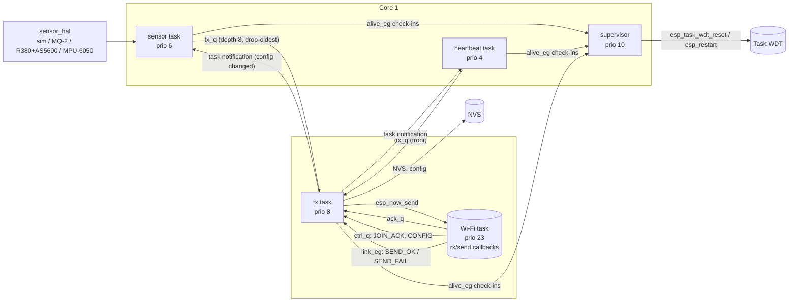
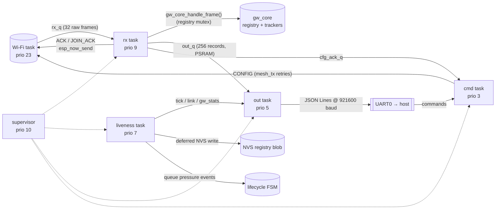
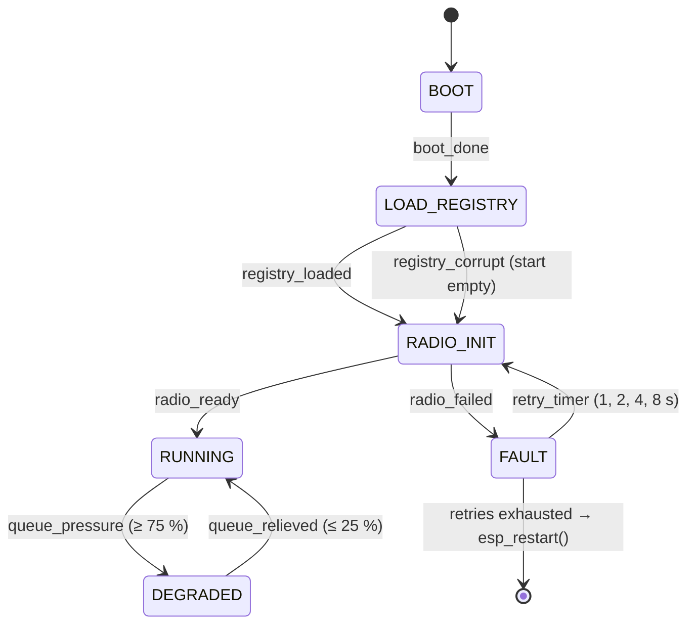
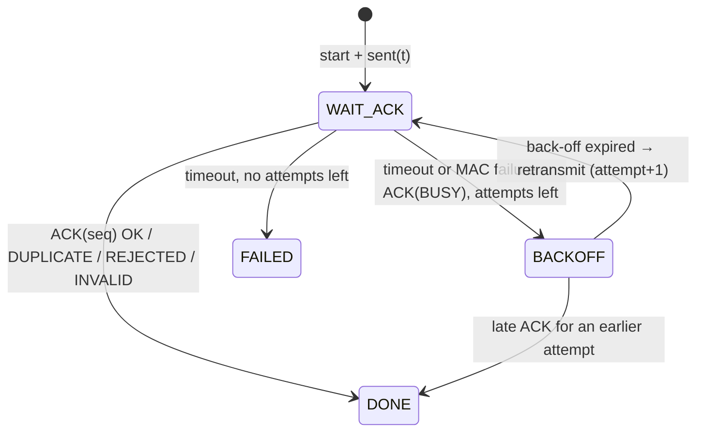

# Architecture

## 1. Repository layout

```
components/
  mesh_protocol/   pure C: frame codec, CRC-16, sequence tracker, retry FSM, MAC/key helpers
  mesh_radio/      ESP-IDF: Wi-Fi/ESP-NOW bring-up, PMK/LMK, peers; loopback test double (QEMU)
sensor_node/       ESP-IDF project (esp32s3)
  components/sensor_hal/   backend vtable + sim, MQ-2, R380/AS5600, MPU-6050, shared I2C bus
  components/node_core/    pure C: persisted configuration schema, validation, CONFIG handling
  main/                    tasks, NVS glue, app_main
gateway/           ESP-IDF project (esp32s3)
  components/gw_core/      pure C: per-frame decision procedure, registry, lifecycle FSM, JSON Lines
  main/                    tasks, NVS glue, serial commands, app_main
host/              CMake: Unity tests, golden-vector generator, discrete-event simulator
src/meshtools/     Python: parser, metrics, live dashboard, figures, reports (`meshdash`)
tests/             pytest suite (+ C golden vectors, QEMU log excerpts)
scripts/           QEMU smoke test, result reproduction
```

**Design rule: logic is pure C, platform code is thin.** Everything that
decides something – framing, validation, retries, duplicate detection, loss
accounting, liveness, lifecycle, JSON formatting, configuration validation,
sensor maths – lives in modules with no ESP-IDF include. They are compiled
three times: into the firmwares, into the host unit tests (with ASan/UBSan) and
into the host simulator. The FreeRTOS tasks only move data between queues and
call those modules.

## 2. Sensor node



| Task | Prio | Core | Stack | Measured peak | Why this priority |
|---|---:|---:|---:|---:|---|
| supervisor | 10 | 1 | 3072 | 888 B | Must run even if an application task spins; short and periodic (1 s). |
| tx | 8 | 0 | 5120 | 2876 B | Latency-critical: waits on ACKs with 30 ms timeouts; CPU bursts are tiny. Same core as the Wi-Fi task to avoid cross-core hand-offs on every frame. |
| sensor | 6 | 1 | 4096 | 1000 B (sim) | Periodic sampling; the AS5600 window samples once per tick (1 kHz) and must not be delayed by lower-priority work. Kept off core 0 so Wi-Fi bursts do not add jitter. |
| heartbeat | 4 | 1 | 3584 | 2272 B | Least urgent; a late heartbeat only delays telemetry. |
| Wi-Fi (IDF) | 23 | 0 | – | – | ESP-IDF's; every application task is far below it so the radio is never starved. |

Measured peaks come from `uxTaskGetStackHighWaterMark()` in QEMU with the
loopback radio (table in [results/stack.md](results/stack.md)). Sizing rule:
**peak × ~1.5 rounded up to 512 B, plus extra head-room where the code path
could not be exercised without hardware** – the ESP-NOW driver inside
`esp_now_send()` (tx) and the real I²C/ADC drivers (sensor). Every heartbeat
carries the high-water mark of each task, so the margins can be re-checked on
real hardware from the gateway log (`hwm` field) without a debugger.
`CONFIG_FREERTOS_CHECK_STACKOVERFLOW_CANARY` and the end-of-stack watchpoint
are enabled as a last line of defence.

**Synchronisation primitives and why each one**

| Primitive | Where | Why this one |
|---|---|---|
| Queue `tx_q` | sensor/heartbeat → tx | Decouples sampling from delivery; bounded memory; drop-oldest when the link is down. |
| Queues `ack_q`, `ctrl_q` | Wi-Fi callback → tx | The callback runs in the Wi-Fi task and must not block: it decodes (≈ 250 B CRC) and posts with timeout 0. |
| Event group `link_eg` | send callback → tx | SEND_OK/SEND_FAIL are *flags* (latest state matters, not a count); `JOINED` is state shared by several readers. |
| Event group `alive_eg` | all tasks → supervisor | One bit per task, cleared atomically by the supervisor each period. |
| Mutex `state_mtx` | cfg + stats | Priority inheritance: the low-priority heartbeat task reads stats that the high-priority tx task writes. |
| Mutex `s_drop_mtx` | producers | Makes "drop oldest + enqueue" atomic between the two producers. |
| Mutex (I²C bus) | AS5600, MPU-6050 | The driver serialises single transactions; this makes *sequences* atomic (1 kHz sampling window, MPU reset/config). |
| Task notifications | producers → tx, tx → sensor/heartbeat | Cheapest wake-up; lets the tx task sleep instead of polling, and lets a CONFIG change restart the periodic schedules immediately. |

A **queue set** was considered for the tx task (one blocking call for `tx_q`
and `ctrl_q`) and rejected: with the drop-oldest policy a producer removes an
item without consuming its set entry, so the set would slowly overflow and
trigger a `configASSERT`. Task notifications give the same "wake on either"
behaviour without that coupling.

**Watchdogs, two layers.** The ESP-IDF Task Watchdog (5 s, panics) watches the
tx and supervisor tasks and both idle tasks (CPU starvation). The application
supervisor gives every task a *liveness budget* (tx: 10 s; sensor and
heartbeat: 2 × their current interval + 5 s, because those intervals are
remotely configurable up to one hour) and restarts the chip with a log line
naming the silent task. In QEMU this supervisor caught a real bug in the
gateway's first command task (blocking `read()` on stdin).

**Radio bring-up is not fatal.** If `mesh_radio_init()` fails the node keeps
sampling (readings queue up with drop-oldest) and the tx task retries every
5 s after tearing the Wi-Fi stack down.

## 3. Gateway



| Task | Prio | Core | Stack | Measured peak | Role / why |
|---|---:|---:|---:|---:|---|
| supervisor | 10 | 1 | 3072 | 1072 B | as on the node |
| rx | 9 | 0 | 4096 | 1044 B | The only task on the ACK path. Highest application priority so ACK latency does not depend on anything else; next to the Wi-Fi task. |
| liveness | 7 | 1 | 3072 | 1776 B | 500 ms timers; must not be starved by output formatting. Also performs the (slow) NVS write so the rx task never touches flash. |
| out | 5 | 1 | 3072 | 1948 B | Formats JSON and writes to the UART; can block on the serial port without delaying ACKs. |
| cmd | 3 | 1 | 4096 | 1736 B | Human-speed input. |

**Back-pressure.** The serial port is the gateway's bottleneck: a DATA line
with all 17 simulated channels averages 486 bytes (measured over the 3 593 DATA
lines of the reference simulation), i.e. ≈ 190 lines/s at 921 600 baud and only
≈ 24 lines/s at 115 200 baud. When `out_q` has no room for the
records of a frame, `gw_core` answers **ACK(BUSY)** *without* accounting the
frame, so the node backs off and retransmits the same sequence number instead
of the reading being silently lost. Queue fill ≥ 75 % moves the lifecycle FSM
to DEGRADED, ≤ 25 % back to RUNNING (hysteresis). The stress scenario in the
README shows this path working.

**PSRAM.** The output queue (256 records × 152 B – `sizeof(gw_out_t)` for
Xtensa – ≈ 38 KB) is created with
`xQueueCreateWithCaps(..., MALLOC_CAP_SPIRAM)` and falls back to internal RAM if
PSRAM is missing (`CONFIG_SPIRAM_IGNORE_NOTFOUND`). It is only accessed from
task context, so cache-disabled periods during flash writes are not an issue.

### Gateway lifecycle state machine



The transition table (`gw_fsm.c`) is data, not code; the host tests walk every
(state, event) pair and assert that exactly these 8 transitions exist. Frames
are only processed in RUNNING and DEGRADED; every transition is emitted as a
`gw_state` JSON line.

### Registry persistence

Node identities (MAC, id, backend, firmware, boot count, intervals) are stored
in NVS as one versioned blob with a CRC-16. After a gateway reboot, restored
nodes start OFFLINE and their ESP-NOW peers are re-added (required for
encryption and for sending CONFIG). Link statistics are volatile by design.

## 4. Sender reliability state machine (`mesh_tx`)



The FSM never sleeps or reads a clock; the caller passes timestamps. That is
what lets the exact same code run under FreeRTOS (`esp_timer_get_time()`), in
unit tests (hand-written timelines) and in the simulator (virtual time).

## 5. Memory and flash

* **Partition table** (16 MB, identical for both): NVS 64 KB, OTA data, PHY,
  core-dump 64 KB, two 4 MB OTA app slots (OTA itself is future work; the layout
  avoids re-partitioning later), 7.8 MB storage.
* **Core dumps** go to flash (`CONFIG_ESP_COREDUMP_ENABLE_TO_FLASH`) for
  post-mortem analysis with `idf.py coredump-info`.
* **No dynamic allocation after start-up** in the application: queues, event
  groups and mutexes are created once in `*_tasks_start()`; large buffers are
  `static`. The only `malloc` is the temporary NVS read buffer at gateway boot.
* Firmware sizes: see [results/firmware_size.md](results/firmware_size.md).

## 6. Host simulator

`host/sim/mesh_sim.c` is a discrete-event simulator (binary heap, µs virtual
time). It links the unmodified `mesh_protocol`, `gw_core`, `node_config` and
`sensor_sim` code and models only what hardware would provide:

* **Radio**: per-node Gilbert–Elliott two-state loss process (bursty loss:
  "good" loss 0.5–2.5 %, "bad" loss 60 %, transition probabilities per frame),
  802.11b 1 Mbit/s airtime (192 µs PLCP + 43 B MAC overhead + payload), MAC ACK
  304 µs, gateway processing 0.3–0.8 ms, RSSI from a per-node base with noise.
* **Node loop**: the same algorithm as `node_tasks.c` (JOIN with back-off,
  drop-oldest queue, stop-and-wait via `mesh_tx`, re-join after 3 failures,
  CONFIG handling).
* **Gateway serial port**: bounded output queue drained at the configured baud
  rate, which is what makes the BUSY/DEGRADED path observable.

Every random decision comes from xorshift32 streams derived from `--seed`; the
test-suite checks that two runs are byte-identical. Channel parameters are
*inputs* chosen to be plausible, not measurements – that is why the results
section separates "validated in simulation" from "pending hardware validation".

## 7. QEMU runs

Espressif's QEMU runs the ESP32-S3 firmware but does not emulate the Wi-Fi PHY
(bring-up hangs in RF calibration). The `mesh_radio` loopback backend
(`sdkconfig.qemu`) replaces only the RF path: an emulated gateway for the
node, four emulated nodes for the gateway (one of which goes silent from 40 s
to 80 s), with 5 % loss. Everything else – tasks, queues, NVS on emulated flash,
JSON output, serial commands – is the production code. CI runs both for
75 s/110 s and asserts joins, traffic, liveness transitions, CONFIG results and
the absence of panics or supervisor restarts.
