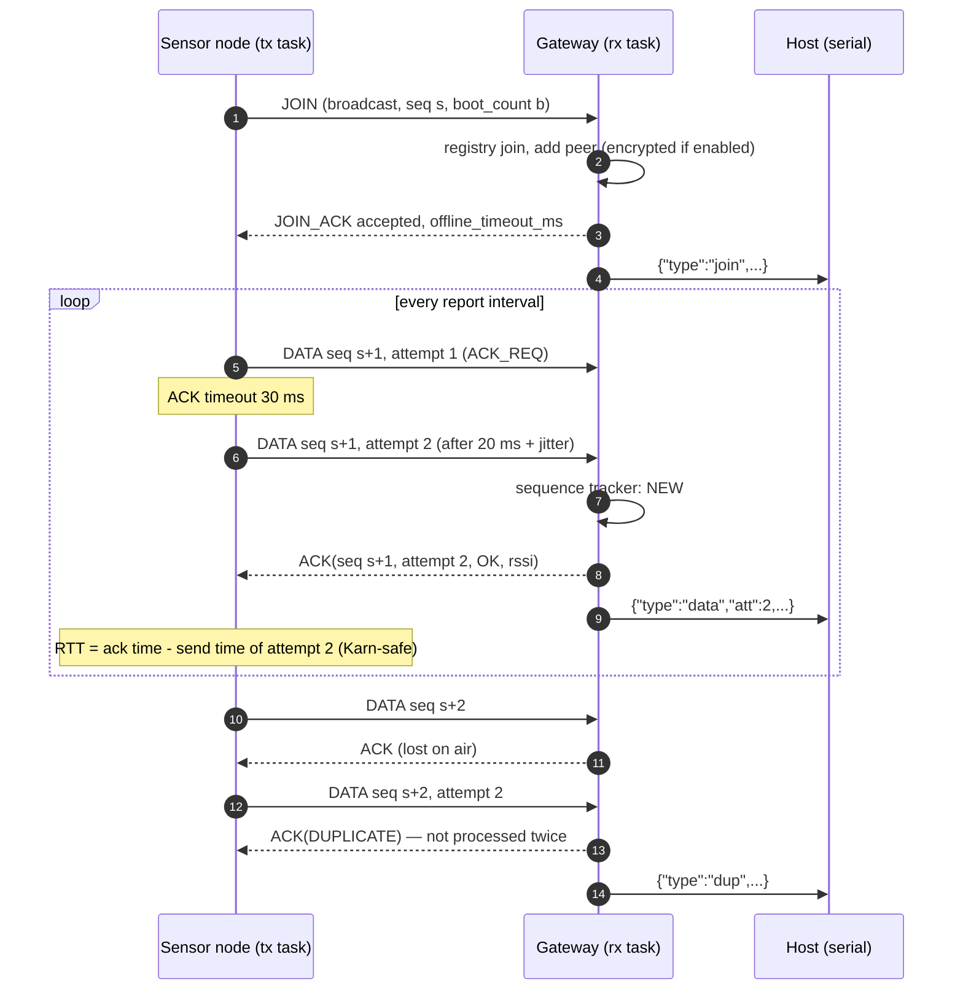
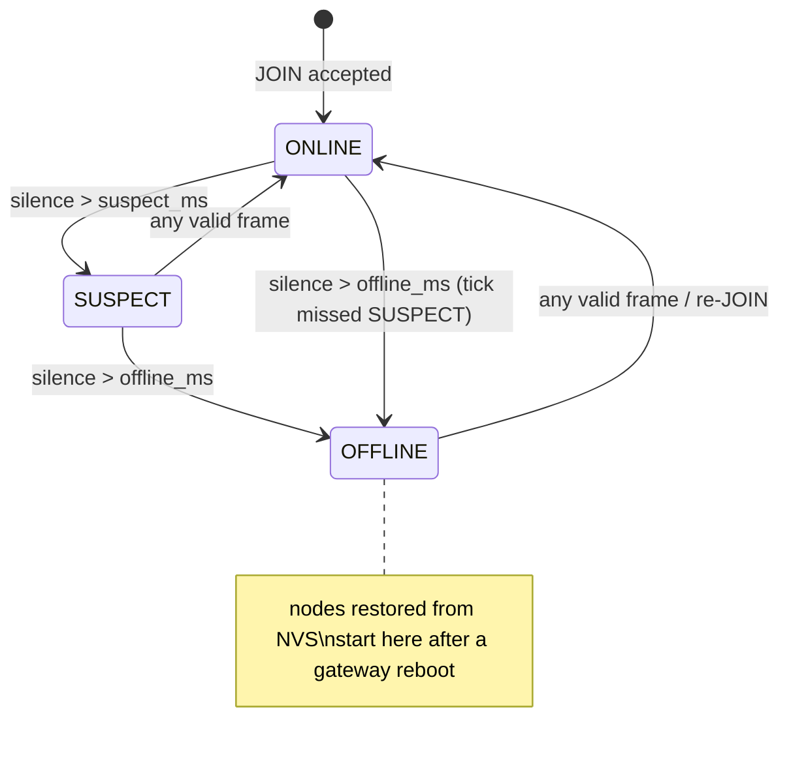

# Mesh protocol specification (version 1)

The reference implementation is `components/mesh_protocol` (C, shared by both
firmwares). `src/meshtools/protocol.py` is an independent Python decoder that is
tested byte-for-byte against golden frames produced by the C codec.

> **Topology note.** Despite the project name, v1 is a *single-hop star*: every
> node talks directly to one gateway over ESP-NOW. Multi-hop relaying is listed
> under future work in the README. "Mesh" refers to the sensor network, not to
> a routing protocol.

## 1. Transport

| Property | Value |
|---|---|
| Link | ESP-NOW v1 (802.11 vendor-specific action frames), unicast + broadcast |
| Max frame | 250 bytes (`ESP_NOW_MAX_DATA_LEN`) |
| Channel | fixed, `CONFIG_MESH_WIFI_CHANNEL` (default 1), same for all devices |
| PHY | 802.11b/g/n default rates; optional Espressif Long Range (`CONFIG_MESH_LONG_RANGE`) |
| Security | optional CCMP via PMK/LMK (section 7) |

ESP-NOW already provides a per-frame MAC-layer acknowledgement for unicast
frames (reported through the send callback). It says "the radio of the peer
received the frame", not "the application processed it". The protocol adds an
**application-level ACK** so the gateway can signal *duplicate*, *busy* and
*unknown node*, and so the node can measure the true round-trip time.

## 2. Frame layout

All multi-byte fields are **little-endian**.

```
offset  size  field        notes
0       1     magic        0x4D ('M')
1       1     version      1
2       1     type         see section 3
3       1     flags        bit0 ACK_REQ, bit1 ENCRYPTED (informational)
4       2     node_id      sender id; gateway = 0x0000, 0xFFFF reserved
6       2     seq          per-sender sequence number, wraps at 65535
8       4     uptime_ms    sender uptime when the frame was built
12      1     attempt      1 for the first transmission, +1 per retry
13      1     payload_len  0..234
14      n     payload      type-specific (section 3)
14+n    2     crc16        CRC-16/CCITT-FALSE over bytes [0, 14+n)
```

The packed C structs in `mesh_protocol.h` document this layout and are guarded
by `_Static_assert`s (sizes and offsets). The codec nevertheless serialises
**field by field**, so it is independent of host endianness and never performs
unaligned loads from radio buffers. A host test asserts that, on a
little-endian machine, the packed struct's memory image equals the codec output.

**CRC choice.** CRC-16/CCITT-FALSE (poly 0x1021, init 0xFFFF; check value
`0x29B1` for `"123456789"`). The 802.11 FCS already protects the air interface;
the application CRC provides end-to-end integrity across buffer copies and
detects frames from incompatible firmware that happen to start with 0x4D. For
frames ≤ 250 bytes the polynomial has Hamming distance 4, so every 1-, 2- and
3-bit error is detected; the host tests verify all single and double bit flips
exhaustively on a 32-byte frame and 20 000 random 1–3-bit mutations of real frames.

**Validation order** (identical in C and Python, error codes in parentheses):
length ≥ 16 (`too_short`) → magic (`bad_magic`) → version (`bad_version`) →
`payload_len` consistent with the received length (`bad_length`) → CRC
(`bad_crc`) → known type (`bad_type`) → type-specific payload size
(`bad_payload`).

## 3. Messages

| Type | Name | Direction | Payload (bytes) | ACK |
|---:|---|---|---|---|
| 1 | JOIN | node → broadcast | fw_version u32, boot_count u32, report_interval_ms u32, heartbeat_interval_ms u32, backend u8, reset_reason u8 (18) | JOIN_ACK |
| 2 | JOIN_ACK | gateway → node | status u8, wifi_channel u8, offline_timeout_ms u32 (6) | – |
| 3 | DATA | node → gateway | backend u8, status u8, last_rtt_us u32, channel_count u8, then N × {quantity u8, value_milli i32} (7 + 5N, N ≤ 20) | ACK |
| 4 | HEARTBEAT | node → gateway | uptime_s, free_heap, min_free_heap, tx_ok, tx_retries, tx_failed, queue_drops, rtt_avg_us, rtt_max_us (u32 each), last_ack_rssi i8, task_count u8, stack_hwm u16 × 6 (50) | ACK |
| 5 | ACK | both | acked_seq u16, acked_type u8, acked_attempt u8, status u8, rssi i8 (6) | – |
| 6 | CONFIG | gateway → node | key u8, value u32 (5) | ACK |

**DATA channels** are `(quantity, value × 1000)` pairs. Quantities:
`gas_mv`, `gas_rs_r0`, `gas_ppm` (MQ-2); `motor_rpm`, `motor_angle_deg`,
`motor_duty_pct`, `enc_status`, `enc_agc` (R380 + AS5600); `accel_{x,y,z}_g`,
`gyro_{x,y,z}_dps`, `imu_temp_c`, `pitch_deg`, `roll_deg` (MPU-6050). Adding a
sensor only adds quantity ids; the frame format does not change. Unknown ids are
forwarded by the gateway as `"q<id>"`.

**ACK status**: `0 OK`, `1 DUPLICATE` (already processed – our previous ACK was
lost; the sender treats it as success), `2 BUSY` (gateway cannot forward right
now – retry after back-off; the frame is *not* accounted), `3 REJECTED` (unknown
node – re-join), `4 INVALID` (e.g. CONFIG value out of range).

**JOIN_ACK status**: `0 accepted`, `1 rejected: full`, `2 rejected: version`,
`3 rejected: node id owned by another MAC`.

**CONFIG keys**: `1 report_interval_ms` (100 … 3 600 000), `2
heartbeat_interval_ms` (1 000 … 600 000), `3 reboot`. Applying a value twice is
idempotent, so a CONFIG retransmitted after a lost ACK is harmless. Accepted
values are persisted in NVS before the next reading.

## 4. Join and delivery



**Stop-and-wait with retries** (`mesh_tx.c`, shared by node, gateway CONFIG
path and simulator). Defaults (Kconfig): 4 transmissions, 30 ms ACK timeout,
back-off 20/40/80 ms (base × 2ⁿ⁻¹, capped at 200 ms) plus uniform jitter
< 10 ms. A MAC-layer failure reported by the send callback skips the ACK wait
and goes straight to back-off. The ACK echoes the **attempt number**, so the
RTT is always measured against the right transmission (Karn's problem): a late
ACK for attempt 1 arriving during the back-off still yields a correct sample.
After the last attempt the frame is abandoned and counted in `tx_failed`;
after `NODE_GATEWAY_LOST_FAILURES` (default 3) consecutive abandoned frames the
node assumes the gateway is gone and re-joins (exponential back-off 0.5 s →
30 s with jitter).

**Why stop-and-wait?** One frame in flight per node keeps the node's memory
footprint and state machine trivial, and at 1 Hz × ~150-byte frames the link
is idle > 99 % of the time; a sliding window would add complexity for no
throughput benefit. The RTT measured in simulation is ≈ 2.6 ms (see README),
so even a 20 Hz node spends < 6 % of its time waiting for ACKs.

**Node TX queue.** Readings wait in a FreeRTOS queue (default depth 8). When
it is full the *oldest* reading is dropped (`queue_drops`) – for monitoring,
fresh data is worth more than stale data. Heartbeats go to the front.

## 5. Sequence numbers, duplicates and loss

Each sender keeps one 16-bit counter for all its frames (JOIN, DATA, HEARTBEAT,
ACK). It restarts at 0 on boot; the boot is announced by `boot_count` in JOIN.

The gateway keeps, per node, a tracker with a 64-entry sliding window (the
IPsec anti-replay window of RFC 4303 adapted to RFC 1982 serial arithmetic):

| Arrival | Classification | Effect |
|---|---|---|
| newer than highest | `new` | `lost += gap`, window shifted |
| equals a seen number within 64 | `dup` | re-ACK with DUPLICATE, not forwarded |
| older, unseen, within 64 | `late` | accepted, `lost -= 1` |
| more than 64 behind | `reset` | sender restarted without a JOIN reaching us |

The tracker is reset **only** when a node is new or its `boot_count` changed.
A re-join after a link outage keeps the tracker, so frames lost during the
outage still appear as a gap. (The first version reset it on every JOIN; the
host simulator exposed that this hid most of the losses of a node suffering an
interference burst.)

`gap` is reported on every JSON record of a frame, so any consumer can rebuild
loss exactly; `meshdash` does so and cross-checks the result against the
gateway's own tracker (periodic `link` records).

## 6. Liveness (node down detection)

Thresholds are derived from the heartbeat interval each node announces in its
JOIN, so nodes with different intervals are judged fairly:

* `suspect_ms = hb_interval × GW_SUSPECT_MISSES (2) + grace (1 s)`
* `offline_ms = hb_interval × GW_OFFLINE_MISSES (4) + grace (1 s)`

Any valid frame (DATA, HEARTBEAT, JOIN, ACK) refreshes `last_seen`. The
liveness task evaluates the timers every 500 ms and emits a `node_state` record
on each transition. The offline threshold is also sent to the node in
JOIN_ACK.



## 7. Security model

Enabled with `CONFIG_MESH_ENCRYPTION`. ESP-NOW then encrypts unicast frames
with CCMP using per-peer LMKs, themselves encrypted with the PMK.

* **What it protects:** confidentiality and integrity of DATA, HEARTBEAT, ACK,
  JOIN_ACK and CONFIG between a node and its gateway; injection of forged
  CONFIG frames (a node only accepts CONFIG from its gateway's MAC over an
  encrypted peer).
* **What it does not protect:** JOIN is a broadcast and ESP-NOW cannot encrypt
  broadcasts, so node id, firmware version and intervals are visible. An
  attacker can spoof JOINs to fill the registry (bounded by `GW_MAX_NODES`) but
  cannot send accepted DATA without the LMK. Replay of captured encrypted frames
  is limited by the sequence window (duplicates are not forwarded) but a replay
  older than 64 frames is classified as a restart – a real replay protection
  would need an authenticated counter (future work).
* **Operational requirements:** with encryption the node must know the gateway
  MAC in advance (`NODE_GATEWAY_MAC`) because it must register the gateway as
  an encrypted peer before it can decrypt the JOIN_ACK. The default PMK/LMK in
  Kconfig are public – change them. ESP-NOW supports at most 17 encrypted peers.
* **Not validated on hardware:** the behaviour of ESP-NOW when a plaintext
  unicast frame arrives from a peer registered as encrypted has not been
  observed in this project (see README "pending hardware validation").

## 8. Gateway JSON Lines (serial output)

One JSON object per line, `\n`-terminated, 921 600 baud on the console UART.
Values are printed with integer arithmetic (no floats), so the host simulator
and the firmware produce byte-identical lines. Non-JSON lines (ESP-IDF logs)
may be interleaved and must be ignored by consumers. Every record has `ts`
(gateway uptime, ms) and `type`.

| type | Emitted when | Key fields |
|---|---|---|
| `boot` | gateway start | `schema`, `proto`, `fw`, `mac`, `channel`, `encryption`, `capacity`, `restored` (nodes loaded from NVS, −1 = corrupt blob) |
| `gw_state` | lifecycle transition | `from`, `to`, `event` |
| `join` | JOIN received | `node`, `mac`, `seq`, `att`, `rssi`, `gap`, `seq_state`, `status`, `new`, `fw`, `boot`, `reset`, `report_ms`, `hb_ms`, `backend[]` |
| `data` | DATA accepted | `node`, `seq`, `att`, `rssi`, `gap`, `seq_state`, `up_ms`, `rtt_us`, `status`, `backend[]`, `values{}` |
| `hb` | HEARTBEAT accepted | … `up_s`, `heap`, `min_heap`, `tx_ok`, `retries`, `tx_fail`, `q_drops`, `rtt_avg_us`, `rtt_max_us`, `ack_rssi`, `hwm[]` |
| `dup` | duplicate suppressed | `node`, `seq`, `att`, `rssi` |
| `node_state` | liveness transition | `node`, `from`, `to`, `silent_ms` |
| `rx_error` | frame rejected | `mac`, optional `node`, `err` (codec error or `unknown_node`/`bad_direction`), `len` |
| `link` | every `GW_STATS_PERIOD_S` | per node: `state`, `rx`, `lost`, `dup`, `late`, `resets`, `loss_ppm`, `rx_err`, `rssi` |
| `gw_stats` | every `GW_STATS_PERIOD_S` | counters, heap, PSRAM, output-queue peak/drops, `nodes{}`, `hwm{task: min free bytes}` |
| `config` | CONFIG finished | `node`, `key`, `value`, `result` (`ok`/`invalid`/`no_ack`/…), `attempts` |
| `info` | command replies | `msg` |

Example (from the simulator):

```json
{"ts":2011,"type":"data","node":1,"seq":2,"att":1,"rssi":-49,"gap":0,"seq_state":"new","up_ms":2000,"rtt_us":2888,"status":1,"backend":["sim"],"values":{"gas_mv":187.91,"gas_rs_r0":1.674,"gas_ppm":181.473,"motor_rpm":1165.593,"motor_angle_deg":153.56,"motor_duty_pct":70.349,"enc_status":32,"enc_agc":126.294,"accel_x_g":0.009,"accel_y_g":-0.003,"accel_z_g":1.003,"gyro_x_dps":0.161,"gyro_y_dps":-0.558,"gyro_z_dps":-0.018,"imu_temp_c":30.977,"pitch_deg":-0.488,"roll_deg":-0.143}}
```

**Serial commands** (typed into the gateway console, answered with `info` /
`config` records): `help`, `stats`, `set <node> report_ms <v>`,
`set <node> hb_ms <v>`, `reboot <node>`, `forget <node>`.

## 9. Versioning and evolution

`version` must match exactly; frames of another version are rejected
(`bad_version`) and counted. Rules for v2: new message types and new quantity
ids are backwards compatible for the gateway's JSON output; any change to an
existing payload layout requires a version bump. The JSON Lines `schema`
number (in `boot`) is independent of the wire version.
